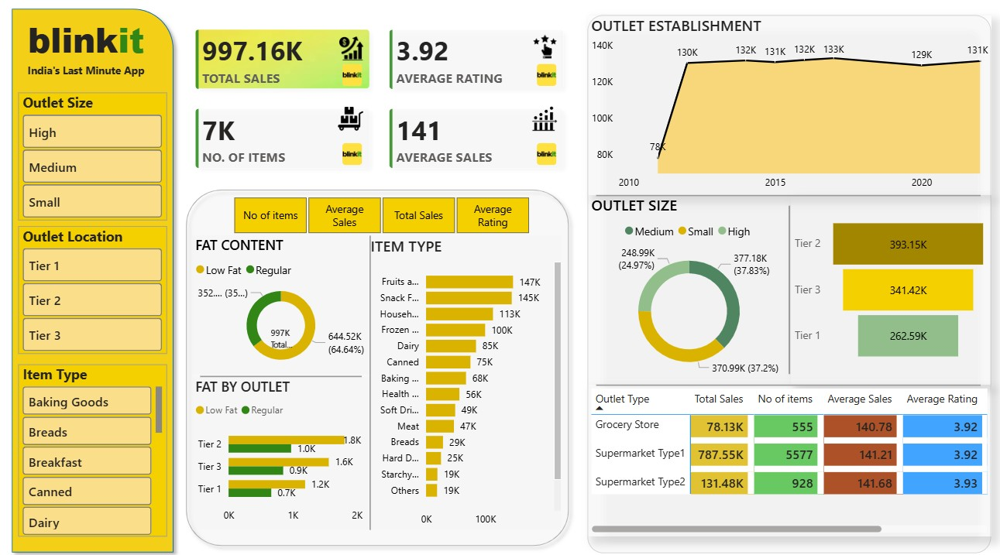

# 📊 Blinkit Sales & Operations Intelligence Dashboard

> An end-to-end Business Intelligence solution built on Blinkit's quick-commerce grocery data — transforming raw transactional records into executive-ready strategic insights using Power BI.

---

## 🖼️ Dashboard Preview


---

## 🚀 Project Overview

This project simulates a real-world BI workflow for Blinkit (India's Last Minute App), one of the fastest-growing quick-commerce platforms. Using a structured dataset of grocery sales, outlet performance, and customer feedback, I designed an interactive Power BI dashboard that enables data-backed decision-making across revenue, operations, and product strategy.

The dashboard is structured to answer four critical business questions:
- **Where is revenue being generated?** (Outlet type, tier, and size)
- **What is selling?** (Category and product-level performance)
- **How satisfied are customers?** (Rating aggregation by channel)
- **Where should we invest next?** (Tier 2/3 expansion signals)

---

## 🎯 Business Problem Statement

Blinkit operates across multiple outlet types, geographic tiers, and product categories. Leadership needs a single source of truth to:
1. Monitor real-time KPIs without querying raw data.
2. Identify underperforming channels and high-ROI expansion zones.
3. Understand demand concentration to optimize inventory procurement.
4. Benchmark outlet types against each other on a unified performance matrix.

---

## 🛠️ Tech Stack & Advanced Implementation

| Layer | Tools Used | Key Application |
|:---|:---|:---|
| **BI & Visualization** | Power BI Desktop | Executive-ready dashboarding |
| **Data Transformation** | Power Query | ETL, null value handling, custom column casting |
| **Analytical Engine** | DAX | Explicit measures, dynamic KPI switching, conditional metrics |
| **Data Modeling** | Star Schema | Optimized 1:Many relationships to avoid performance bottlenecks |
| **UI/UX Design** | Custom Design | Container architecture, glassmorphic accents, brand-matching palette |

### 🧠 Technical Highlights
* **Dynamic Metric Switching:** Implemented a selection matrix supporting dynamic metric toggles (`No of items`, `Average Sales`, `Total Sales`, `Average Rating`) updating the primary horizontal category distributions instantly without bloating the canvas.
* **Schema Optimization:** Structured a clean Star Schema model ensuring optimal query processing times and cross-filtering across geographic and categorical dimensions.

---

## 📈 Key KPIs Tracked

| Metric / KPI | Consolidated Value | Business Significance |
| :--- | :---: | :--- |
| 💰 **Total Sales** | `$997.16K` | Aggregate revenue health across the delivery pipeline |
| 📦 **No. of Items** | `7K` | Total product volume/SKUs processed and cleared |
| 📊 **Average Sales** | `$141.00` | Mean revenue generated per unit item |
| ⭐ **Average Rating** | `3.92 / 5.0` | Consolidated customer satisfaction benchmark |

---

## 🖥️ Dashboard Architecture

### 🔘 Left Panel — Global Slicers
Dynamic filtering mechanics allowing cross-filtering across all visual tokens:
- **Outlet Size** (High / Medium / Small)
- **Outlet Location** (Tier 1 / Tier 2 / Tier 3)
- **Item Type** (16+ product categories including Fresh Produce, Snacks, and Dairy)

### 📦 Center Panel — Product Intelligence
- **Dynamic Variable Bar Chart:** Displays metric values mapped instantly by item classification.
- **Donut Chart:** Measures product split by fat content (Low Fat vs. Regular).
- **Stacked Bar Charts:** Evaluates Fat content performance segmented across localized outlet tiers.

### 📍 Right Panel — Operational Analytics
- **Area Chart:** Analyzes historical sales performance trends based on outlet establishment years (2010–2022).
- **Donut & Funnel Charts:** Displays revenue breakdown by physical outlet size footprint and geographical tier classifications.
- **Matrix Grid:** A localized benchmarking table tracking individual `Outlet Type` behaviors across all 4 key baseline KPIs simultaneously.

---

## 💡 Key Business Insights & Data-Driven Strategy

### 🥇 1. Supermarket Type 1 is the Core Revenue Engine
Supermarket Type 1 drives **$787.55K (~79% of total revenue)**. Interestingly, the average value per item remains tightly bounded across all outlet formats (~$141). This explicitly proves that Type 1's dominance is driven entirely by **high transaction volume velocity** rather than premium item sales.

* **Recommendation:** Allocate capital toward optimizing order-fulfillment workflows, staffing, and inventory storage depth specifically at Type 1 hubs to maximize order throughput.

### 🛒 2. Fresh Produce & Impulse Categories Drive Velocity
**Fruits & Vegetables ($147K)** and **Snack Foods ($145K)** lead as primary revenue drivers. This patterns confirms that quick-commerce applications thrive heavily on high-frequency daily staples and immediate gratification/impulse buys.

* **Recommendation:** Implement strict dark-store inventory buffering and shelf-availability automation for these two categories to mitigate stockouts.

### 📍 3. Tier 2 & Tier 3 Cities Outperform Tier 1 Metros
Tier 2 ($393.15K) and Tier 3 ($341.42K) locations heavily outpace Tier 1 ($262.59K) markets in total sales. This indicates rapid quick-commerce adoption and lower competitive saturation in growing suburban/regional areas.

* **Recommendation:** Aggressively redirect expansion budgets toward regional hubs, using Tier 1 formats primarily as brand anchors.

### 📐 4. Medium-Sized Outlets Offer Peak Scale Efficiency
Medium-sized outlets capture the largest market share split (**$370.99K / 37.2%**). They strike the perfect sweet spot between physical infrastructure overhead costs and sales volume output.

* **Strategic Playbook:** The highest-ROI expansion plan for Blinkit is deploying **Medium-sized, Supermarket Type 1 fulfillment centers throughout Tier 2 cities.**

---

## 📂 Repository Structure

```text
blinkit-dashboard/
│
├── BlinkIT Dashboard.pbix        # Power BI Dashboard file
├── blinkit.jpg                   # Dashboard preview image
└── README.md                     # Documentation
```text
---

## Cfcd
